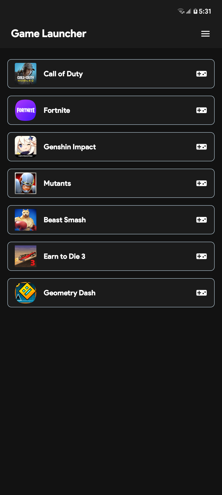
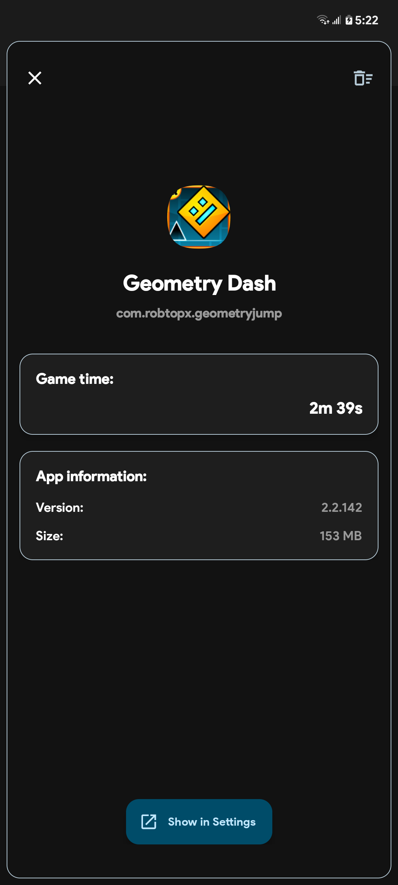

  

# Game Launcher
Is a simple and efficient app designed to house your favorite games in an organized manner. With a clean and user-friendly interface, this app lets you add and manage your games either manually or automatically.  

## 📷 Screenshots

## 📦 Installation

Download the latest version [here](https://github.com/ToastcodeDev/Game-Launcher/releases)  
Android 8.0 or higher.

## 📋 Contributing

Contributions are welcome! Feel free to make a [bug report](https://github.com/ToastcodeDev/Game-Launcher/issues) or submit a [pull request](https://github.com/ToastcodeDev/Game-Launcher/pulls).

## 📜 License

This project is licensed under the  [GPL-3.0](https://www.gnu.org/licenses/gpl-3.0.html) License  
Copyright © 2024 [ToastcodeDev](https://github.com/ToastcodeDev).
